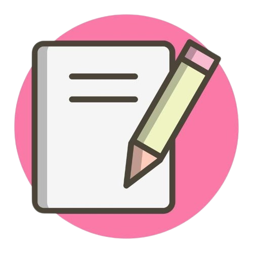

# Take Note

<div align="center">
  
</div>

<p align="center">
  
  
  
  
</p>

> Ứng dụng ghi chú trực tiếp trên trình duyệt, hỗ trợ lưu trữ dữ liệu, ghim, chỉnh sửa và xóa ghi chú nhanh chóng.

## 📑 Mục lục

- [✨ Tính năng](#tính-năng)
- [🛠️ Công nghệ sử dụng](#công-nghệ-sử-dụng)
- [📁 Cấu trúc dự án](#cấu-trúc-dự-án)
- [🚀 Demo](#demo)
- [▶️ Cách chạy](#cách-chạy)
- [📘 Hướng dẫn sử dụng](#hướng-dẫn-sử-dụng)
- [⚠️ Lưu ý](#lưu-ý)
- [👤 Tác giả](#tác-giả)

## Tính năng

- Thêm ghi chú mới
- Ghim ghi chú ở phần "Đã ghim"
- Chỉnh sửa nội dung ghi chú
- Xóa ghi chú
- Lưu dữ liệu trong trình duyệt bằng `localStorage`
- Giao diện đơn giản, dễ sử dụng

## Công nghệ sử dụng

- HTML5
- CSS3
- JavaScript

## Cấu trúc dự án

```bash
Take-note/
├── index.html
├── style.css
├── main.js
├── keepnote-removebg-preview.png
├── README.md
└── ...
```

## Demo

Trải nghiệm trực tiếp tại đây:
https://heimingtou.github.io/ghi-ch-/

## Cách chạy

### Cách 1: Mở trực tiếp trong trình duyệt
1. Mở file `index.html` bằng trình duyệt (Chrome, Edge, Firefox).
2. Sử dụng ứng dụng ngay mà không cần cài đặt thêm.

## Hướng dẫn sử dụng

1. Nhập nội dung ghi chú vào ô nhập ở thanh điều hướng.
2. Nhấn nút `Save` để lưu ghi chú.
3. Click vào một ghi chú để chỉnh sửa.
4. Dùng biểu tượng ghim để giữ ghi chú trong phần "Đã ghim".
5. Dùng biểu tượng thùng rác để xóa ghi chú.

## Lưu ý

- Dữ liệu ghi chú được lưu trong `localStorage` của trình duyệt, nên sẽ còn tồn tại khi bạn reload trang.
- Nếu bạn xóa dữ liệu trình duyệt hoặc xoá `localStorage`, các ghi chú sẽ bị mất.

## Tác giả

- Tác giả: Hà Minh Thơ
- Dự án mini project Note App được xây dựng để thực hành frontend cơ bản.
